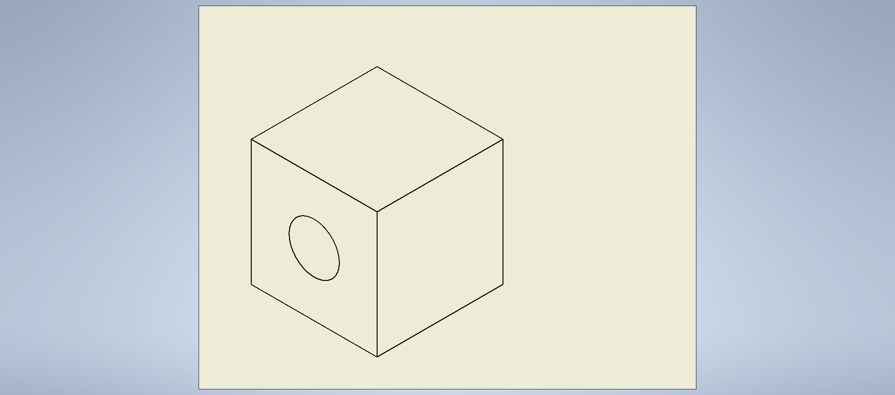

# Inventor Addin Application

## Overview
This project is an add-in application developed in C# using Visual Studio 2022 for Autodesk Inventor. The add-in creates an extruded cube with a hole in it and exports it to a JPG image drawing.

## Features
- Generates an extruded cube with a hole.
- Exports the generated model to a JPG image drawing.

## Installation
1. Clone this repository to your local machine.
   ```bash
   git clone https://github.com/Coderanildangi/InventorAddIn_Cube-With-Hole.git
   ```
2. Open the solution file `InventorAddin.sln` in Visual Studio 2022.
3. Build the solution to ensure all dependencies are resolved.

## Usage
1. Open Autodesk Inventor.
2. Load the add-in:
   - Go to the **Tools** menu.
   - Select **Add-Ins**.
   - Click **Add**, and browse to select the compiled `InventorAddin.dll`.
   - Ensure the add-in is checked to load it.
3. Once the add-in is loaded, a new command or button should be available within the Inventor interface.
4. Click on the command/button to execute the add-in functionality.
5. The add-in will generate an extruded cube with a hole and export it to a JPG image drawing.

## Dependencies
- Autodesk Inventor
- Visual Studio 2022

## Contributing
Contributions are welcome! Please feel free to open a pull request or submit an issue if you encounter any bugs or have suggestions for improvements.

## License
This project is licensed under the [CCtech License](LICENSE).

## Authors
- [Your Name](https://github.com/yourusername)

## Output
- .png>)
- 

